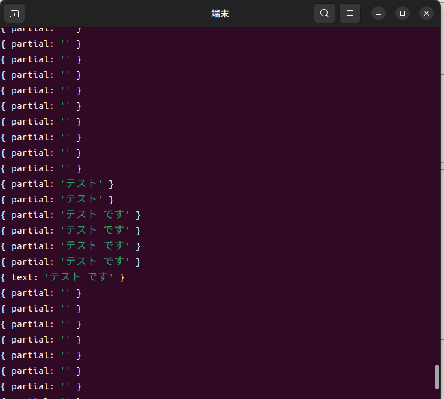
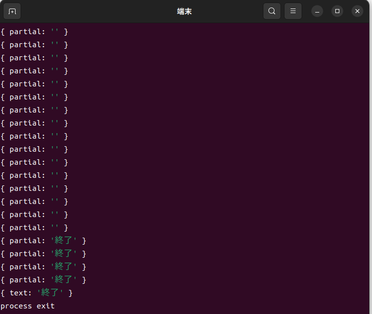

## これはなにか

オフラインで音声認識結果をコンソールに出力するアプリケーション

## 環境構築

1. ローカル PC に`nodejs`をインストールする(https://nodejs.org/en/download/ にてインストーラをダウンロードしてインストールする。)。

2. 以下のコマンドでモジュールをインストールする。

   ```
   npm install
   ```

## 使い方

0. `https://alphacephei.com/vosk/models` から `vosk-model-small-ja-0.22` をダウンロードして、本ディレクトリ配下の`model`ディレクトリに中身を配置する(具体的なディレクトリ構成は下記を参照。解凍したディレクトリの名前を`model`に変更して README.md があるディレクトリと同じディレクトリに配置すればよい。)。

   ```
   ./
   |_model
      |-am/
      |-conf
      |-graph
      |-ivector
      |_README
   ```

1. `node voice_recognition_demo.js` をコマンドラインで実行する。

2. 以下のように話した結果が以下のように出力される。

   - partial: 途中結果

   - text: 最終的な結果

   

3. 終了と話すとコマンドラインツールが終了する。

   

## 使用ライブラリ

- https://github.com/alphacep/vosk-api を使用した。

  ライブラリの特徴として、以下が挙げられる。

  - 比較的多国籍の言語に対応している。

  - 対応しているプログラミング言語の種類が多い

    - c

    - c#

    - go

    - swift(ios)

    - java(android にはこちらで対応している様子)

    - nodejs

    - python

    etc

  - 比較的モデルが軽量(一応、重いモデルもよう(英語など)。日本語は軽量モデルしか無い。)

## 所感

- 軽量モデルな割に比較的精度がよい。

- とはいえ、会話のリアルタイム処理などは難しいと思われるので、スタートワード(OK Google, Hey siri など)に使用するのが妥当と思われる。
